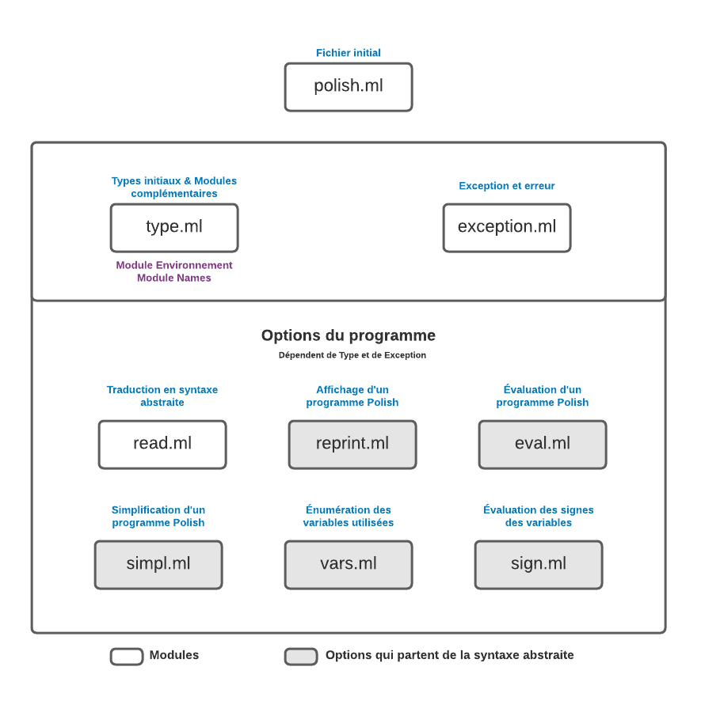
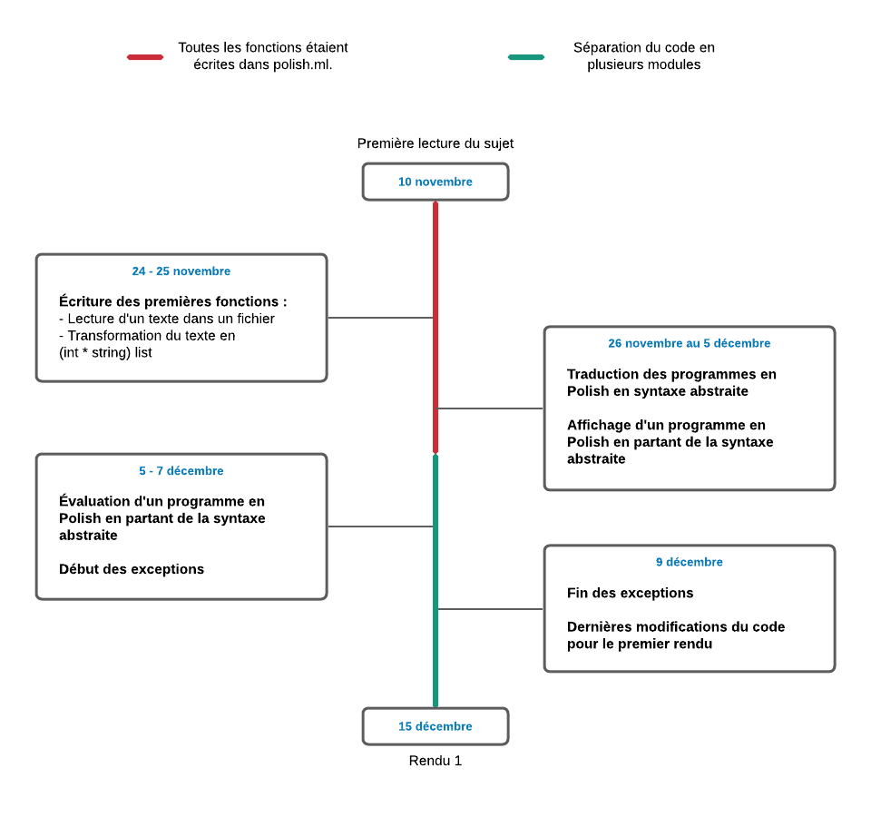
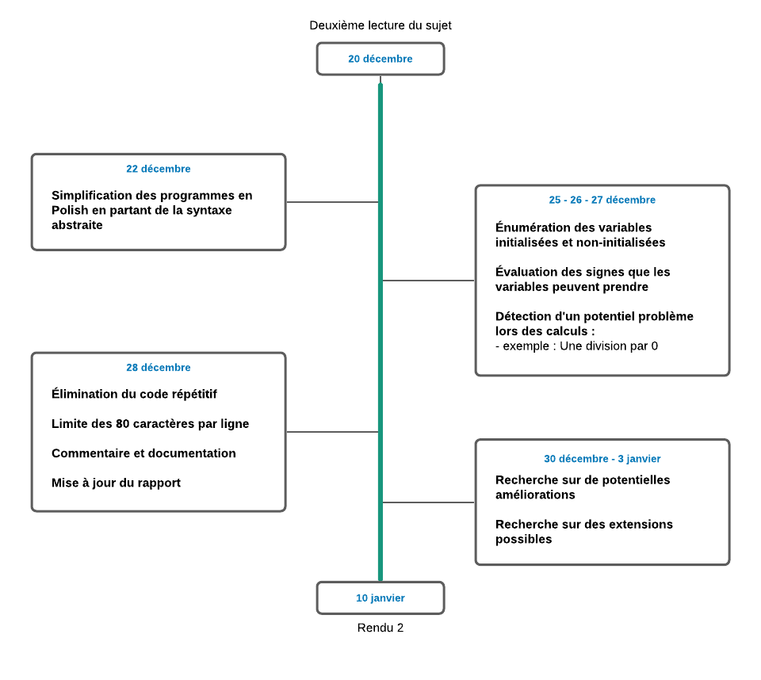

# Projet PF5 2021 : Polish

## Sommaire
1. [Introduction et informations](README.md#introduction-et-informations)
2. [Fonctionnalités](README.md#fonctionnalités)
3. [Compilation, exécution et arguments possibles](README.md#compilation-execution-et-arguments-possibles)
4. [Découpage modulaire](README.md#découpage-modulaire)
5. [Organisation de travail](README.md#organisation-de-travail)

-------------------------------------------------------

## Introduction et informations
**Informations généraux**
- Le sujet du projet : [projet.pdf](https://gaufre.informatique.univ-paris-diderot.fr/pf5-profs/pf5-projet/blob/master/projet.pdf)
- Modalités du projet, des rendus et de l'évaluation : [CONSIGNES.md](https://gaufre.informatique.univ-paris-diderot.fr/pf5-profs/pf5-projet/blob/master/CONSIGNES.md)
- Usage de git et de Gitlab : [GIT.md](https://gaufre.informatique.univ-paris-diderot.fr/pf5-profs/pf5-projet/blob/master/GIT.md)
- Prérequis à installer : [INSTALL.md](https://gaufre.informatique.univ-paris-diderot.fr/letouzey/pf5/blob/master/INSTALL.md)

**Identifiants et membres du groupe**
1. TANG Elody, @tange, 21953199

## Fonctionnalités

**Fonctionnalités principales :**

1. Lecture d'un fichier contenant un programme Polish et traduction en syntaxe abstraire selon les types indiquées (avec les exceptions et les erreurs obtenues),
2. Affichage un fichier contenant un programme Polish en partant de la syntaxe abstraite obtenue,
3. Évaluation d'un programme en syntaxe abstraite,
4. Simplification avec une analyse statique d'un programme Polish en partant de la syntaxe abstraite obtenue,
5. Énumération des variables initialisées et non-initialisées,
6. Évaluation des signes possibles pour chaque variables,

**Fonctionnalités secondaires :**

1. Limitation du nombre d'arguments dans les commandes d'exécution
2. Écriture de la fonction d'usage (pour l'aide des commandes)

## Compilation execution et arguments possibles

**Compilation et éxécution**

Il existe deux méthodes pour compiler et exécuter le programme Polish :
1. la première méthode est de passer par la compilation `dune` et le lancement `run`.
2. la deuxième méthode est d'utiliser les commandes directes de Ocaml.

Ouvrez un terminal et suivez les commandes indiquées selon la méthode souhaitée.

**Première méthode : Compilation `dune` et lancement `run`**

- `make` sans argument lancera la compilation `dune` de `polish.exe`.
- `./run arg1 arg2` lancera le programme avec les arguments utilisés.
- `make clean` pour effacer le répertoire provisoire `_build` produit par `dune` lors de ses compilations.

**Deuxième méthode : Commandes directes de Ocaml**

- `ocamlc type.ml exception.ml read.ml reprint.ml eval.ml simpl.ml vars.ml sign.ml polish.ml -o polish` lancera la compilation.
- `./polish arg1 arg2` lancera le programme avec les arguments utilisés.
- `rm *.cmi *.cmo polish` effacera les fichiers de compilation et les fichiers d'exécution.

**Les arguments possibles lors de l'exécution**

**Pour `arg1`**

1. `-reprint` : Affichage d'un fichier contenant un programme Polish en partant de la syntaxe abstraite obtenue
2. `-eval` : Évaluation d'un fichier contenant un programme Polish en partant de la syntaxe abstraite obtenue
3. `-simpl` : Simplification avec une analyse statique d'un programme Polish en partant de la syntaxe abstraite obtenue
4. `-vars` : Énumération des variables initialisées et non-initialisées
5. `-sign` : Évaluation des signes possibles pour chaque variables,

**Pour `arg2`**

Chemin du fichier contenant un programme Polish

## Découpage Modulaire

**Schéma et arborescence des fichiers et des modules**

**Description des traitements pris en charges**

Module initial polish : *Ce module possède toutes les fonctions de lancement du programme Polish. Il lance les fonctionnalités du programme suivant les différents arguments. Si l'utilisateur utilise des arguments non reconnus ou non implémentés, alors le programme affichera un message d'aide.*

Module type et exception : *Dans le module type, il y a toutes les structures des types que le programme va utiliser. Le module exception va gérer les exceptions et les erreurs que le programme va effectuer (comme une mauvaise écriture d'un fichier en Polish).*

Module read et reprint : *Le rôle des modules read et reprint est expliqué sur le schéma ci-dessus.*

Module eval : *Le rôle du module eval est expliqué sur le schéma ci-dessus. Pour évaluer le programme Polish en partant d'une syntaxe abstraite, j'ai utilisé un module supplémentaire `Module Environnement = Map.make(String)` que j'ai placé dans le fichier `type.ml` qui va symboliser un tableau de mémoire entre les variables et leurs valeurs. À chaque fois qu'une ligne va être lu, le tableau va enregistrer toutes les variables lues et toutes les valeurs lues. Les variables qui sont présentes dans des boucles IF ou WHILE seront ainsi enregistrées et pourront être utilisées en dehors de leur boucle initial. Lorsqu'une variable va changer de valeur, si la variable existe déjà dans le tableau de mémoire, dans l'environnement, alors elle sera effacée et remplacée par la nouvelle valeur (ce qui évitera les doublons). Sinon elle sera ajoutée automatiquement.*

Module simpl : *Le module simpl sert à la simplification d'un programme Polish en partant de la syntaxe abstraite. Pour établir cette simplification, le programme va traduire le programme en syntaxe abstraite puis va repérer toutes les expressions qui peuvent être simplifiées. Pour les conditions, si le programme peut les évaluer, la simplification va dépendre du résultat de la condition : si la condition est satisfaite, alors il appliquera le sous block, sinon il lira la suite du programme en ignorant le sous block.*

**Exemples :**

| Programme initial | Simplification |
| ----------------- | -------------- |
| a := * + 18 7 8   | a := 200       |

Module vars : *Le module vars va énumérer les variables utilisées dans un programme. Sur la première ligne, il y aura toutes les variables utlisées, et sur la seconde, il y aura les noms des variables qui sont utilisées sans être initialisées. Pour repérer les variables, j'ai utilisé une liste du module `Module Names = Set.make(String)` qui est dans le fichier `type.ml`. Le programme va lire les lignes une par une et va placer les variables dans la liste. Si elle est initialisée par un SET ou un READ, le programme va placer le string suivant `[nom_de_la_variable] INIT` dans la liste, sinon, elle va juste placer le nom de la variable `[nom_de_la_variable]` dans la liste. À la fin du programme Polish, le programme va faire la différence entre les variables initialisées et les variables mal/non-initialisées et va les afficher.*

Module sign : *Ce module évalue les potentiels signes des variables qui sont utilisées. Pour faire cette évaluation, j'ai utilisé le module `Module Environnement = Map.make(String)`. Le pragamme va lire les lignes une par une et va placer les variables et leurs signes dans la map. *

**Exemples de certaines évaluations des signes :**

| Expression                            | Signe évaluée  |
| ------------------------------------- | -------------- |
| + [valeur positive] [valeur positive] | Pos            |
| + [valeur positive] [valeur negative] | Neg, Zero, Pos |
| - [valeur positive] [valeur positive] | Neg, Zero, Pos |
| - [valeur negative] [valeur negative] | Neg, Zero, Pos |
| - [valeur negative] [valeur positive] | Neg            |
| * [valeur positive] [valeur positive] | Pos            |
| * [valeur positive] [valeur negative] | Neg            |
| * 0 [valeur positive]                 | Zero           |
| / [valeur positive] [valeur positive] | Pos            |
| / [valeur positive] [valeur negative] | Neg            |
| / [valeur positive] 0                 | Error          |

*Le module affiche aussi une dernière ligne. Elle va afficher `safe` si le programme se fait sans erreur, sinon, elle va afficher `divbyzero [ligne]` avec la ligne où il peut se produire un problème de calcul comme une division par zéro. Pour implémenter cette dernière ligne, j'ai utilisé `let is_safe = ref "safe"` qui est une référence. Je suppose que le programme est sécurisé et qu'il n'y aura pas de problème de calcul. Si le programme croise une division par zéro, alors la référence change en fonction de la position de la division (ou le numéro de ligne).*

**Quelques problèmes d'implémentation :**

*Au début, j'ai essayé d'implémentater `is_safe` avec un type ou un string qui va passer par toutes les fonctions du programme. Mais cette implémentation était trop lourde, et il était impossible de faire un code lisible et je n'arrivais pas à enregistrer le bon message d'erreur. Alors j'ai préféré passer par un champ changeant, facile d'accès.*

## Organisation de travail

**Brève chronologie du travail effectué**

